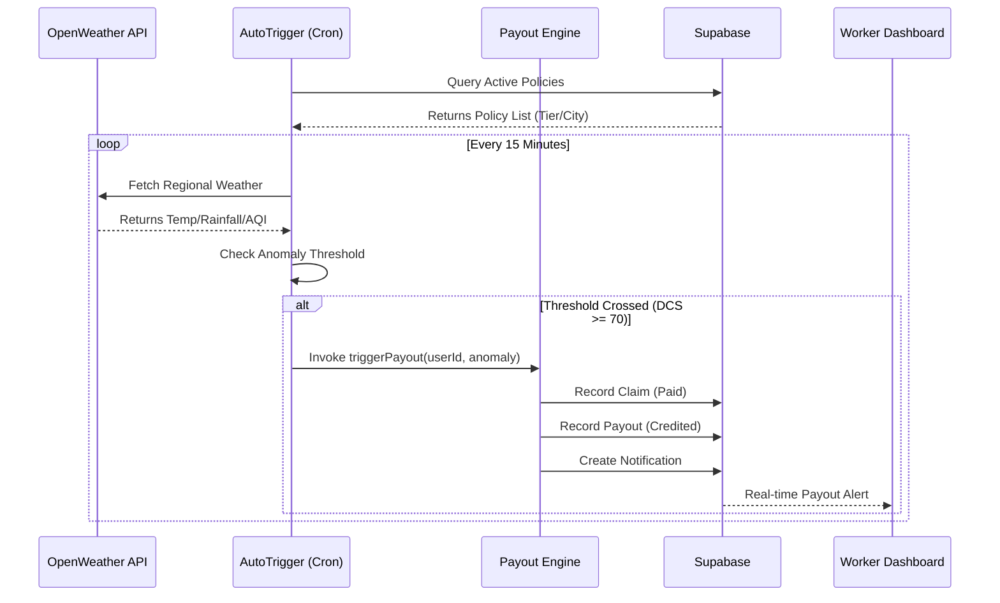

# GigKavacham: Complete Technical Hand-off Document

## 1. System Architecture Overview

GigKavacham is a parametric insurance ecosystem composed of three interoperable services.

### Service Matrix
| Service | Tech Stack | Primary Responsibility | Port |
| :--- | :--- | :--- | :--- |
| **Frontend** | React 18, Vite, Tailwind, Motion | Worker Dashboard, Onboarding, Real-time Charts | 5173 |
| **Backend** | Node.js, Express, node-cron | Payout Orchestration, Weather Polling, Supabase Integration | 3001 |
| **ML Server** | FastAPI, Scikit-learn, joblib | Multi-model Inference (Pricing, DCS, Fraud, Intent) | 5001 |
| **Database** | Supabase (PostgreSQL) | Authentication, Profile Persistence, Transaction Logs | Cloud |

---

## 2. Core Operational Logic

### 2.1 Disruption Composite Score (DCS)
The DCS is a parametric risk metric (0-100) that triggers automated payouts when it exceeds the threshold (70).

**Base Formula:**
`DCS_base = (Rainfall × 0.30) + (AQI × 0.25) + (Heat × 0.20) + (OrderDrop × 0.15) + (Social × 0.10)`

**Final Calculation with Multipliers:**
`DCS_final = min( round( DCS_base × M_season × M_hour × M_tier × 100 ), 100 )`

- **Multipliers**:
  - `M_season`: 1.25 during Monsoon (Jun-Sep), 1.00 otherwise.
  - `M_hour`: 1.10 during Peak delivery windows (7-9 AM, 5-8 PM).
  - `M_tier`: Tier-based risk amplifier (Metro: 1.05, Rural: 1.20).

### 2.2 Financial Model V2 (Pricing)
Premiums are dynamic and recalculated at activation based on real-time environmental risk.

**Formula:**
`Total Premium = Base_Plan_Rate × Season_Mult × Tier_Mult × Behavioral_Mult`

- **Behavioral Multiplier**: Calculated from the `Shield Score` (75 by default).
- `Multiplier = 1 - ((ShieldScore - 75) / 250)`

---

## 3. ML Model Inventory

The `backend/ml/models` directory contains 28+ pre-trained models.

### Key Model Categories:
- **Pricing**: `pricing_model.pkl` (XGBoost Regressor) + Scalers/Encoders. Calculates environmental risk loading.
- **Forecasting**: `dcs_rf_model.pkl` (Random Forest) & `dcs_prophet.pkl` (Time-series). Predicts future risk window.
- **Fraud**: `fraud_isolation_forest.pkl` & `fraud_xgb_classifier.pkl`. Detects GPS spoofing and claim anomalies.
- **NLP**: `all-MiniLM-L6-v2` (SBERT) + Logistic Regression. Classifies 17 distinct worker intents.

---

## 4. Automated Payout Workflow

The system uses a recursive polling strategy to monitor real-world disruptions.



---

## 5. Deployment & Setup Guide

### Environment Configuration (.env)
You must configure these variables in both the root and `backend/` directories.

```env
# Supabase Configuration
SUPABASE_URL=your_project_url
SUPABASE_SERVICE_KEY=your_service_role_key

# External APIs
OPENWEATHER_API_KEY=your_api_key

# Internal Service Mapping
ML_SERVICE_URL=http://localhost:5001
PORT=3001
```

### Detailed Execution Steps

#### A. Starting the ML Inference Server
Requires Python 3.10. Ensure the `venv` is active.
1. `cd backend`
2. `venv/Scripts/activate`
3. `python ml/services/ml_server.py`
4. *Verify:* Request `GET http://localhost:5001/health`

#### B. Starting the Node.js Operations Layer
Requires Node.js 18+.
1. `cd backend`
2. `npm install`
3. `npm run dev` (Starts `ts-node-dev` server on 3001)

#### C. Starting the React Frontend
1. `project_root/`
2. `npm install`
3. `npm run dev` (Starts Vite on 5173)

---

## 6. Future Implementation Roadmap

### Phase 4: Expansion
- **KYC Integration**: Automated Aadhaar-linked identity verification for insurance scaling.
- **Multi-Chain Transparency**: Porting payout logs to a public ledger (e.g., Polygon) to verify parametric transparency for investors.
- **Micro-Zoning**: Transitioning from Tier-based risk to coordinate-based risk (500m hyper-local DCS).

### Phase 5: Retention
- **Shield Score Rewards**: Gamified dashboard where workers can reduce premiums by 20% through safe riding and zone compliance.
- **WhatsApp Support Bot**: Integration with Twilio for headless claim notification and status checks.

---
*For technical support or scaling queries, contact the development lead.*
